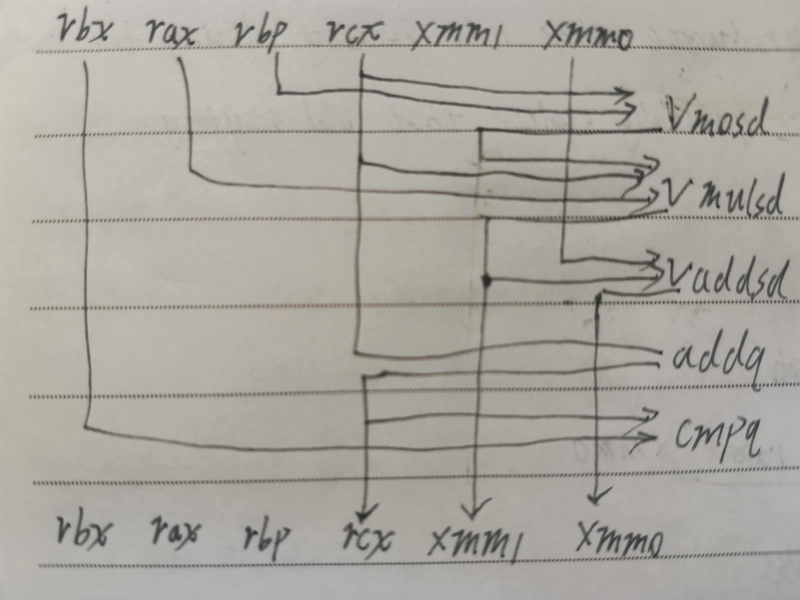
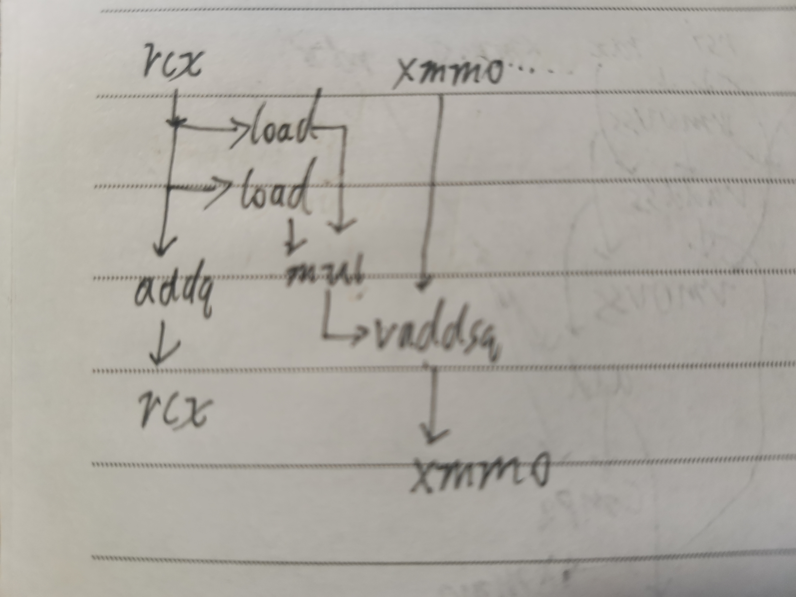

# CSAPP第五章家庭作业

## 5.13

* A
    
    
* B
    浮点加法延迟3
* C
    整数加法延迟1
* D
    整数乘法操作不在关键路径上

## 5.14

```c++
void inner4(vec_ptr u, vec_ptr v, data_t *dest)
{
    long i;
    long length = vec_length(u);
    data_t *udata =  get_vec_start(u);
    data_t *vdata =  get_vec_start(v);
    data_t sum = (data_t) 0;

    for(i =0;i<length;i+=6)
        sum = sum + udata[i]*vdata[i]
            +  udata[i+1]*vdata[i+1]
            +  udata[i+2]*vdata[i+2]
            +  udata[i+3]*vdata[i+3]
            +  udata[i+4]*vdata[i+4]
            +  udata[i+5]*vdata[i+5];
    for(;i<legth;++i)
        sum += udata[i]*vdata[i];
    *dest = sum;
}
```

* A
    X1展开无法突破加法延迟界限
    因为关键路径上有n个加法，延迟最低为1
* B
    浮点加法延迟为5

## 5.15

```c++
void inner_6x6(vec_ptr u, ver_ptr v, data_t *dest)
{
    long i;
    long length = vec_length(u);
    long limit = length - 6;
    data_t *udata = get_vec_start(u);
    data_t *vdata = get_vec_start(v);
    data_t sum0 = sum1 = sum2 = sum3 = sum4 = sum5 = (data_t) 0;
    
    for (i = 0; i < limit; i+=6) {
        sum0 += udata[i] * vdata[i];
        sum1 += udata[i+1] * vdata[i+1];
        sum2 += udata[i+2] * vdata[i+2];
        sum3 += udata[i+3] * vdata[i+3];
        sum4 += udata[i+4] * vdata[i+4];
        sum5 += udata[i+5] * vdata[i+5];
    }
    
    for (; i < length; i++) {
        sum0 = sum0 + udata[i] * vdata[i];
    }
    *dest = sum0 + sum1 + sum2 + sum3 + sum4 + sum5;
}
```

## 5.16

```c++
void inner4(vec_ptr u, vec_ptr v, data_t *dest)
{
    long i;
    long length = vec_length(u);
    data_t *udata =  get_vec_start(u);
    data_t *vdata =  get_vec_start(v);
    data_t sum = (data_t) 0;

    for(i =0;i<length;i+=6)
        sum +=( (udata[i]*vdata[i] +  udata[i+1]*vdata[i+1])
                (+ udata[i+2]*vdata[i+2] +  udata[i+3]*vdata[i+3])
                (+ udata[i+4]*vdata[i+4] +  udata[i+5]*vdata[i+5]) );
    for(;i<legth;++i)
        sum += udata[i]*vdata[i];
    *dest = sum;
}
```

## [5.17](5-17.c)

## [5.18](5-18.c)

*   未做优化下，对于`double`与`long`,运行时间几乎减半。
*   gcc、clang的`-O3`优化与msvc的`/O2`优化下，运行时间为未优化的约八成。

## [5.19]()